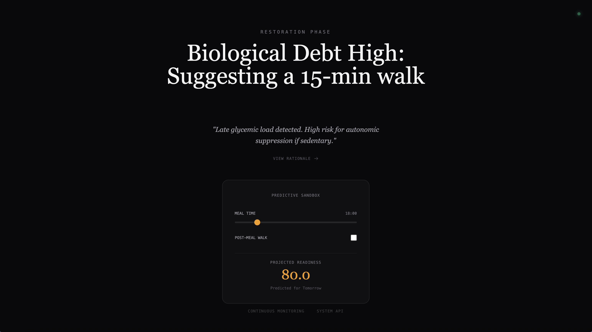
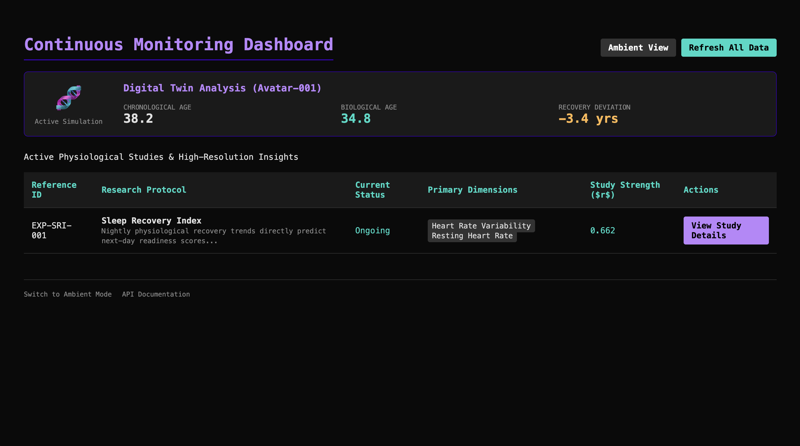
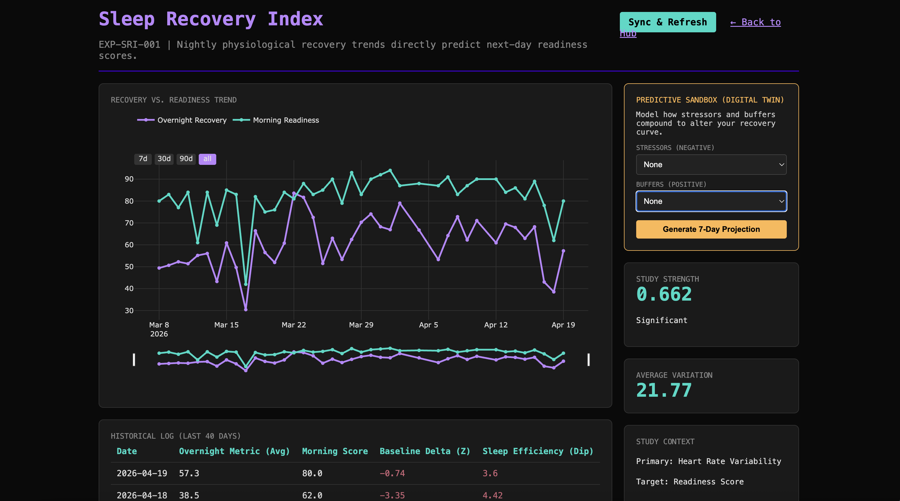
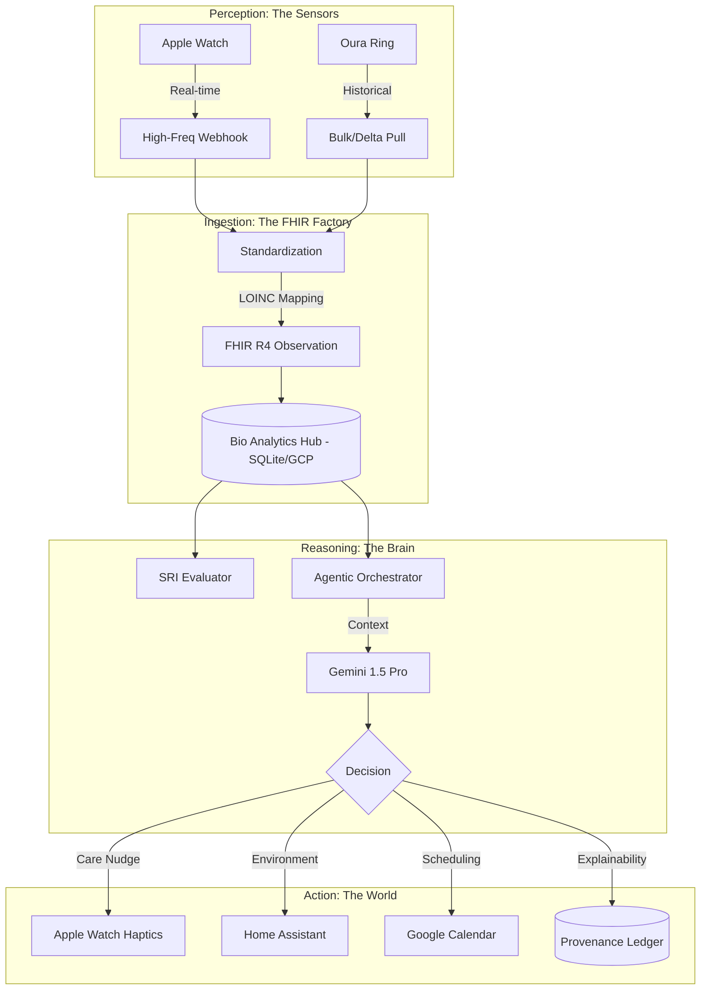

# Bio-Analytics Hub: Your Personal Digital Health Laboratory

The **Bio-Analytics Hub** is an advanced, provider-independent physiological research platform. It is designed to transform high-frequency biometric data into a **Multi-Scale Digital Twin (MSDT)**, enabling individuals to quantify recovery, simulate lifestyle interventions, and automate their environment for optimal longevity.

---

## 🎨 The Longevity OS Experience (Dual UI)

The system features a **Dual-Interface Strategy** designed to balance "Calm Tech" with "High-Resolution Research."

### 1. The Ambient View (Center of the Cyclone)
*   **Purpose:** A minimalist, low-friction interface for real-time biological guidance.
*   **Features:** Displays high-level "Agent States" (e.g., "Biological Debt") and immediate corrective actions (e.g., "Suggesting a 15-min walk").
*   **Predictive Sandbox:** Integrated slider for simulating the immediate impact of interventions on tomorrow's readiness.



### 2. The Analytical Hub (Continuous Monitoring)
*   **Purpose:** A high-density dashboard for monitoring your Multi-Scale Digital Twin (MSDT).
*   **Features:** Real-time tracking of biological age, chronological age, and "Recovery Deviation."
*   **Study Management:** Direct access to active physiological research protocols (e.g., Sleep Recovery Index).



### 3. Sleep Recovery Index (Experiment Detail)
*   **Purpose:** Deep-dive analysis into the relationship between overnight recovery and next-day readiness.
*   **Predictive Simulation:** Sidebar for modeling the compound effects of stressors (Alcohol, Late Meals) and buffers (Sauna, Breathwork) on your 7-day recovery curve.



---

## 🏛 Macro Architecture: The Big Picture

The system operates as a **Closed-Loop Control System**, moving through four distinct layers: **Perception**, **Ingestion**, **Reasoning**, and **Action**.



---

## 🏗 Micro Architecture: The Component Layer

Built on **Clean Architecture** principles, the repository is organized to enforce strict separation of concerns:

| Directory | Layer | Responsibility |
| :--- | :--- | :--- |
| `app/adapters/` | **Infrastructure** | Provider-specific logic (Oura, Apple, Home Assistant). |
| `app/domain/` | **Core Domain** | Universal biometric dimensions and FHIR mapping. |
| `app/engine/` | **Application** | The "Brains." Simulation, SRI evaluation, and Agentic logic. |
| `app/core/` | **System** | Database management, normalization, and provenance logging. |
| `app/api/` | **Interface** | FastAPI routes and Jinja2 templates. |
| `config/` | **Configuration** | Research protocols (YAML) and haptic trigger thresholds. |

---

## 🛣 User Journeys

### 1. The Real-time "Care Nudge" (Agentic Haptics)
The system proactively protects your recovery state using LLM-powered context evaluation.
*   **The Trigger:** A significant HRV drop (>20%) is detected relative to your 7-day rolling average.
*   **The Reasoning:** Gemini analyzes recent history to distinguish between "Good Difficulty" (planned workout) and "Toxic Stress."
*   **The Action:** If toxic, a haptic prompt is sent to your watch suggesting a 2-minute physiological sigh.
*   **The Proof:** The entire reasoning path is hashed and logged to the **Provenance Ledger** (PA-XDT).

### 2. The Predictive Sandbox (Digital Twin Simulation)
Forecast the biological cost of your evening before it happens.
*   **Interaction:** Select "Late Night Pizza" or "Alcohol" in the Study Detail UI.
*   **Simulation:** The engine generates a **Synthetic Day**, shifting your "Hammock Curve" (HR dip) based on metabolic load.
*   **Insight:** The UI auto-zooms to a 7-day window, shading the area between your baseline and the prediction in **Crimson (Debt)** or **Teal (Surplus)**.

---

## 🚀 Feature Availability & Roadmap

The platform has successfully transitioned through the following architectural milestones:

| Feature | Phase | Status | Description |
| :--- | :--- | :--- | :--- |
| **Biometric Hub** | Base | ✅ Live | SQLite-backed tracking of HR, HRV, and Sleep. |
| **SRI Research** | NAR | ✅ Live | Sleep Recovery Index study with Z-Score normalization. |
| **DT4H-Sim** | Phase 1 | ✅ Live | Clinical-grade FHIR R4 interoperability and LOINC codes. |
| **Predictive MSDT** | Phase 2 | ✅ Live | Vector-based 24h physiological forecasting. |
| **Secular Witness** | Phase 3 | ✅ Live | Event-driven Agent Orchestrator & Gemini Reasoning. |
| **Existential Flux** | Phase 4 | ✅ Live | Provenance Ledger (PA-XDT) for verifiable AI decisions. |
| **Longevity OS UI** | Phase 5 | ✅ Live | Dual UI (Ambient vs Analytical) with Predictive Sandbox. |
| **Mobile Edge** | Phase 6 | 🚧 Dev | Native watchOS HR streaming and haptic actuation. |

---

## 🛠 Usability & Setup

### 1. Historical Hydration
Establish your 21-day baseline immediately by pulling historical data:
```bash
export OURA_PAT="your_token"
python3 scripts/bulk_load_oura.py 90
```

### 2. Dashboard Interaction
*   **Refresh All:** One-click sync and evaluation for the latest 72 hours.
*   **Time-Series Zoom:** Toggle between 7d, 30d, and 90d macro-trends.
*   **Simulation Sandbox:** Manually add stressors/buffers to see projected recovery.

### 3. Clinical Diagnostics
Access the built-in laboratory tools:
*   **Interactive API (Swagger):** `/docs`
*   **Database Integrity:** `/db-status`
*   **Decision Audit:** `/api/v1/agent/provenance` (Coming soon)

---

## 🧪 Verification & Reliability
The system maintains a **100% test pass rate** across 38 verified unit, integration, and E2E tests.
```bash
export PYTHONPATH=$PYTHONPATH:.
python3 -m pytest tests/
```

---
*Designed for those who view longevity as a science and recovery as a performance state.*
