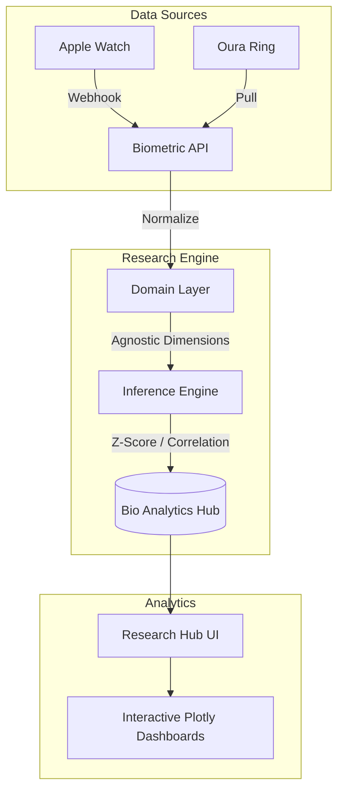
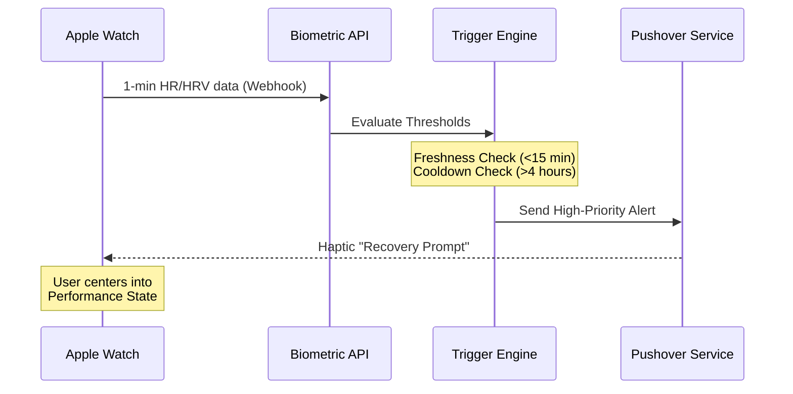
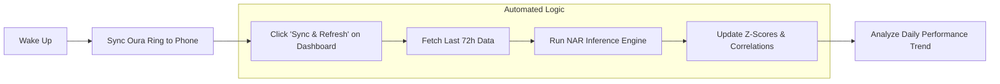
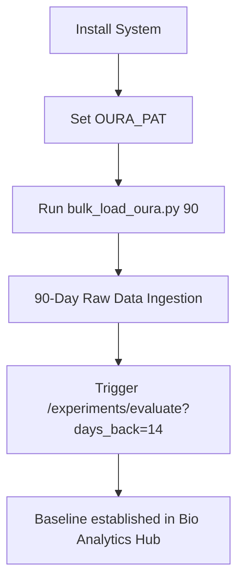

# Bio-Analytics Hub: Your Personal Digital Health Laboratory

The **Bio-Analytics Hub** is an advanced **personal health monitoring platform** designed for individuals seeking a high-precision, data-driven approach to longevity and performance. By unifying disparate biometric streams from wearables like the **Oura Ring** and **Apple Watch**, the hub transforms raw physiological data into actionable, research-grade insights.

## 🌟 Overview

Built for **longevity enthusiasts**, **biohackers**, and **performance athletes**, this platform empowers users to become the principal investigators of their own health. It moves beyond simple "activity tracking" to formal **Inference-Driven Research**, allowing you to quantify how specific lifestyle interventions or recovery protocols actually impact your autonomic nervous system.

### Why "Hardware-Agnostic"?
The system is **Provider-Agnostic**—meaning it works independently of any single hardware ecosystem. Whether you upgrade your watch or switch to a new biometric ring, your historical research data and Z-score baselines remain intact, protecting your long-term health narrative from proprietary "data silos."

## 🏗 System Architecture
...

The platform follows **Clean Architecture** principles to ensure provider-agnosticism and research integrity.



## 🛣 User Journeys

### 1. Real-time Performance Prompt (Haptic Trigger)
When physiological stress is detected, the system provides immediate haptic feedback to prompt a recovery state.



### 2. Daily Insights Cycle
The standard morning workflow to update research dashboards.



### 3. Historical Research Backfill
Establishing a robust physiological baseline for new users.



## 📊 Visual Gallery

Explore the platform's analytical interfaces. 

### 1. Main Biometric Dashboard
High-resolution monitoring of Heart Rate, HRV, and State Decryption.


### 2. Agnostic Biometric Research Hub
The central registry for managing and tracking physiological research protocols.


### 3. NAR Study Laboratory (EXP-NAR-001)
Deep-dive inference showing overnight recovery trends vs. morning readiness.


## 🧬 Core Logic: The NAR Study

The flagship **Nocturnal Autonomic Research (NAR)** study (`EXP-NAR-001`) analyzes the relationship between high-resolution nocturnal data and daily readiness.

### Key Research Metrics
*   **Baseline Delta (Z)**: Measures deviations from your personal 21-day physiological baseline using Z-Score normalization ($Z = \frac{x - \mu}{\sigma}$).
*   **Sleep Efficiency (Dip)**: Analyzes the "Hammock Curve" of your heart rate. Dips occurring after 03:00 AM indicate autonomic misalignment and are automatically flagged.

## 🛠 Operation Guide

### 1. Hydration & Sync
To establish a statistically sound baseline, hydrate the system with historical data:
```bash
export OURA_PAT="your_token"
python3 scripts/bulk_load_oura.py 90
```

### 2. One-Click Refresh
The platform features a built-in refresh mechanism. Clicking **"Sync & Refresh"** on any dashboard will:
1.  Trigger a delta-sync from all providers.
2.  Recalculate study results for the last 72 hours.
3.  Update all interactive charts.

## 📚 Interactive Laboratory
The system is fully documented via OpenAPI. Access these endpoints directly on your deployed instance:
*   **Interactive API Docs**: `/docs`
*   **Technical Reference**: `/redoc`

---
*Designed for precise measurement of Peak Autonomic Recovery and Performance States.*
